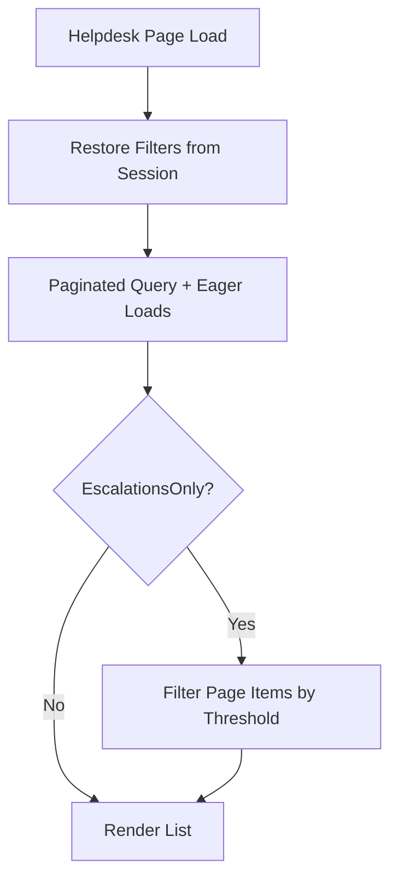

# ITSS Helpdesk — Functional Overview and Flowcharts

This document summarizes how the Helpdesk module works in this app (Laravel 11 + Livewire 3), based directly on the code in `App\Livewire\ITSS\Helpdesk`, models under `App\Models\Helpdesk\*`, observers, and services.

## Scope
- Ticket lifecycle: create → assign → work → resolve/close
- Filters, paging, and real-time updates
- SLA and escalations
- CSAT capture
- Auditing and notifications

## Key endpoints and components
- Route: `GET /helpdesk` → `App\Livewire\ITSS\Helpdesk` (layout: `layouts.enduser`).
- Primary view: `resources/views/livewire/i-t-s-s/helpdesk.blade.php`.
- Core models:
  - `Helpdesk\Ticket`, `TicketCategory`, `TicketAttachment`
  - `CsatResponse`, `TicketAuditLog`, `TicketActivityLog`, `TicketWatcher`, `SlaPolicy`, `SlaEscalation`
- Observers: `TicketObserver`, `TicketCommentObserver` (registered in `AppServiceProvider`).
- Services: `SlaResolver`, `AssignmentResolver`, `SlaInsights`, `Notifier`.

## Ticket creation flow
1. User opens Helpdesk and clicks "New Ticket".
2. Livewire validates: subject, description, priority, optional category.
3. If category requires verification (e.g., "Account Access"), user must upload ID front/back or COR.
4. SLA policy is picked for default type=incident and selected priority via `SlaResolver::pickPolicy`, computing `sla_due_at`.
5. Ticket is created with `status=open`, `priority`, `requester_id`, optional `category_id`, and verification state.
6. Auto-assignment: `AssignmentResolver::resolveAssigneeId($ticket)` can set `assignee_id` based on rules and subject/description matching.
7. Verification uploads (if any) are stored on the `private` disk and linked as `TicketAttachment` records.
8. UI is reset, and a `TicketChanged(ticketId, 'created')` event is fired (Reverb/broadcast-ready) for real-time updates.

### Ticket number format
- `HD-{year}-{sequence}` where sequence is `id + 1` padded to 5 digits at creation time.

## Ticket listing and filters
- Query-string bound filters: search, status, priority, type, category, assignee, mine, unassigned, escalationsOnly, page.
- `updating()` resets pagination on filter changes and ensures mutually exclusive toggles (mine vs unassigned) and assignee selection logic.
- `tickets` computed property returns a paginated (10 per page), eager-loaded list: requester, assignee, category, latestSubmittedCsat.
- `escalationsOnly` refines the current page in-memory to tickets within any active escalation threshold for their SLA policy.

## SLA and escalations
- `SlaPolicy` determines `sla_due_at` when creating tickets.
- `SlaEscalation` stores thresholds (minutes before breach). When `escalationsOnly` is active, tickets with remaining minutes ≤ any threshold are shown.
- Helper counts shown in the UI:
  - Due today: open/in_progress tickets with `sla_due_at` in today’s range.
  - Breached: open/in_progress tickets with `sla_due_at` < now.

## CSAT capture
- On status transitions to resolved/closed (handled in `TicketObserver@updated`), a `CsatResponse` record is ensured/updated for the requester.
- Email invitations are currently disabled in code comments, relying instead on in-app prompting when viewing tickets.
- `Helpdesk::showCsat($ticketId)` loads the latest submitted CSAT for display.

## Audit trail and activity log
- `TicketObserver` writes immutable `TicketAuditLog` entries (event and serialized changes) for created/updated/deleted.
- `TicketActivityLog` captures human-readable activity messages (e.g., ticket created, status/priority/type changes).
- The UI can display audit trail events to admins (not detailed in this doc, but wired via relationships).

## Notifications
- Real-time: `TicketChanged` broadcasts; the Helpdesk view listens for `helpdesk-ticket-changed` (via Echo/Reverb) to refresh and optionally notify.
- Email: `Notifier` service can send emails for comments and updates to Watchers and involved users (assignee/requester), honoring preferences in `UserNotificationPreference`.

## Admin and agent roles
- Agents/admins can filter by assignee, toggles for Mine/Unassigned, and use the escalations-only view to prioritize.
- Category list at left helps scoping tickets.

## Flowcharts

Below are Mermaid flowcharts to visualize the key flows. You can render them using any Mermaid-compatible viewer.

### 1) Ticket creation
```mermaid
flowchart TD
  A[Open Helpdesk] --> B[Click New Ticket]
  B --> C{Requires Verification?}
  C -- No --> D[Fill Subject, Description, Priority, Category]
  C -- Yes --> E[Select Method: ID Card or COR]
  E --> F[Upload Files]
  D --> G[Pick SLA via SlaResolver]
  F --> G
  G --> H[Create Ticket: status=open, sla_due_at]
  H --> I{Auto-assign?}
  I -- Yes --> J[AssignmentResolver sets assignee]
  I -- No --> K[Leave Unassigned]
  J --> L[Store uploads on private disk]
  K --> L
  L --> M[Dispatch TicketChanged(created)]
  M --> N[UI Resets + Toast]
```

### 2) Ticket list filtering and escalation view


### 3) Status update and CSAT invitation
```mermaid
flowchart TD
  A[Ticket Updated] --> B[TicketObserver@updated]
  B --> C[Compute changes; write TicketAuditLog]
  C --> D[Write TicketActivityLog]
  D --> E{Status is resolved/closed?}
  E -- Yes --> F[Ensure CsatResponse record]
  F --> G[In-app CSAT prompt available]
  E -- No --> H[No CSAT change]
```

## Notes and considerations
- Security: ensure routes are protected and role policies are applied for admin actions.
- Files: verification attachments are on the `private` disk; serve via authorized endpoints only.
- Performance: eager loading prevents N+1; SLA insights and reports pull optimized subsets.
- Real-time: Echo/Reverb hooks exist; ensure Pusher/Reverb keys/host are configured in `.env`.

## Related files
- Component: `app/Livewire/ITSS/Helpdesk.php`
- View: `resources/views/livewire/i-t-s-s/helpdesk.blade.php`
- Models: `app/Models/Helpdesk/*`
- Observers: `app/Observers/*`
- Services: `app/Services/Helpdesk/*`
- Route: `routes/web.php` (`/helpdesk`)
